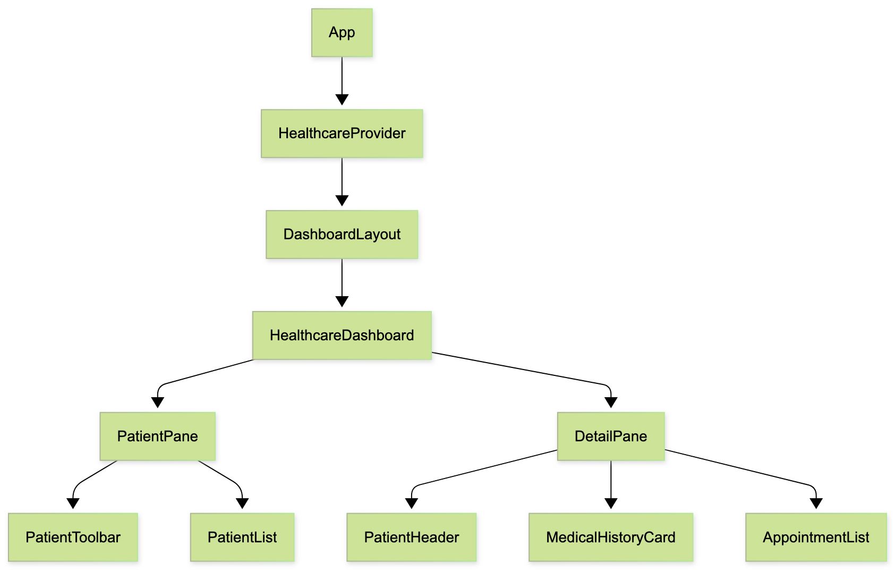
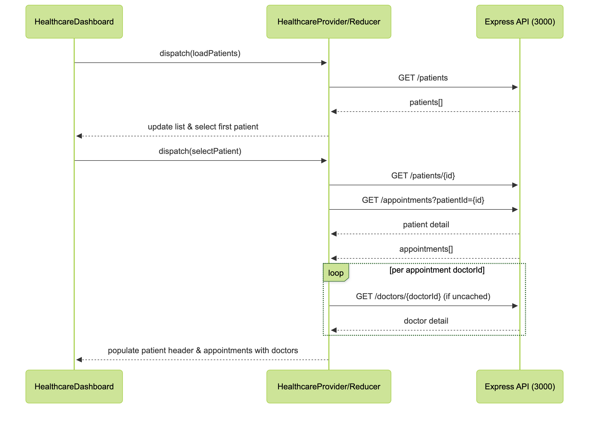

# Healthcare Frontend Design Document

## 1. Overview
The healthcare MVP already includes a running Express API at `http://localhost:3000`, exposing patients, doctors, and appointments via REST endpoints. Our responsibility is the frontend only. We start from Creative Tim’s Material Dashboard React template (Create React App–based), and we configure it with an `.env` file so the CRA dev server hosts the UI at `http://localhost:3001`. During development the frontend proxies requests directly to the backend hostname/port, so no backend modifications are needed.

The user experience targets clinicians who need to browse a roster of patients, inspect demographic and medical-history details, and review appointment schedules with doctor attribution. The frontend must orchestrate data fetching, state management, and feedback states (loading, empty, error) while preserving Material Design visuals, responsiveness, and accessibility baked into the template.

## 2. Goals & Scope
### Functional Objectives
1. **Patient roster browsing** – Fetch the full patient list via `GET /patients`, render it in a searchable, scrollable pane, and highlight the active selection.
2. **Detail inspection** – When a patient is selected, retrieve their record (`GET /patients/{id}`) and display demographics, gender, age, and their medical history narrative.
3. **Appointment visibility** – Pull appointments for the selected patient (`GET /appointments?patientId={id}`) and decorate each entry with doctor name, date/time, and reason. Gracefully handle the case where a patient has no appointments.
4. **Doctor attribution** – Pull doctor metadata (bulk or per-id) so appointments show the provider name/specialty without redundant network calls.
5. **User feedback** – Surface loading indicators, empty states, and actionable error messaging (with retry capability) for every data-fetching surface.
6. **Template integration** – Embed the feature into the Material Dashboard layout, respecting its navigation, cards, typography, and theming primitives.

### Non-Functional Objectives
- **Technology constraints** – Leverage React hooks and context/reducer patterns for predictable state and keep dependencies aligned with the existing template.
- **Performance & caching** – Avoid unnecessary API calls by memoizing doctor data and reusing patient lists instead of re-fetching on every interaction.
- **Reliability** – Ensure each async action reports clear loading/error status so the UI never stalls silently; fallback content must cover missing data.
- **Accessibility & responsiveness** – Maintain focus states, keyboard navigation, ARIA labeling where needed, and adapt layout for tablet/mobile breakpoints defined by Material Dashboard.
- **Separation of concerns** – Keep API access in dedicated service modules and isolate UI components so future CRUD extensions can slot in without architectural changes.

## 3. Architecture
```
App
└─ HealthcareProvider
   └─ DashboardLayout (template shell)
      └─ HealthcareDashboard (feature shell)
         ├─ PatientPane
         │   ├─ PatientToolbar (search/filter)
         │   └─ PatientList
         └─ DetailPane
             ├─ PatientHeader (card w/ demographics)
             ├─ MedicalHistoryCard
             └─ AppointmentList
```



### Component Responsibilities
- **HealthcareProvider** – Wraps the entire SPA, manages global state (patients, doctors, appointments), and exposes action creators for fetching server data.
- **DashboardLayout** – Existing template shell; integrates sidenav, navbar, and responsive container but leaves feature logic untouched.
- **HealthcareDashboard** – Feature entry point; triggers initial patient load, handles patient selection, and arranges panes using the template grid system.
- **PatientPane**
  - **PatientToolbar** – Provides search input and optional filters (e.g., gender) powered by in-memory filtering of the patient list.
  - **PatientList** – Renders patient names with status badges (age/gender), highlights selection, and supports keyboard navigation.
- **DetailPane**
  - **PatientHeader** – Shows primary demographics and quick actions (e.g., future edit button placeholder).
  - **MedicalHistoryCard** – Displays the `medicalHistory` text with truncation/expand behavior and scroll handling.
  - **AppointmentList** – Lists appointments grouped chronologically, enriching each entry with doctor metadata and handling empty/error states.

### State Management
- **Context + Reducer** – `HealthcareContext` exposes state and dispatch via `useContext`. Reducer keeps slices normalized and immutable.
- **State slices**: `patients`, `patientsMeta` (loading/error), `selectedPatientId`, `patient`, `patientMeta`, `appointments`, `appointmentsMeta`, `doctorsById`, `doctorsMeta`.
- **Actions/Effects** – Async thunks (`loadPatients`, `selectPatient`) live alongside context provider. They dispatch `REQUEST/SUCCESS/FAILURE` patterns so UI surfaces can react precisely.

### Data Layer
- `src/services/api.js` centralizes HTTP access:
  - `BASE_URL = process.env.REACT_APP_API_URL || 'http://localhost:3000'`.
  - `request(path, options)` handles fetch, JSON parsing, and error normalization.
  - Resource helpers: `getPatients()`, `getPatient(id)`, `getAppointmentsByPatient(id)`, `getDoctors()`, `getDoctor(id)` (with memoization in the context layer).
- Doctor cache stored in reducer (`doctorsById`) to avoid re-fetching; lazy population when appointments reference unseen doctor IDs.

## 4. UI/UX Design
- **Information layout** – Two-pane composition with Patient pane fixed around 340px on large screens and Detail pane filling remaining width. On screens <960px, Patient pane collapses into a slide-in drawer triggered from the navbar, keeping details front and center.
- **Patient toolbar & list** – Toolbar houses search (debounced) and optional filters (gender). List rows feature avatar initials, full name, age/gender chips, and status indicator (e.g., appointments count). Active row gains left-accent bar plus background tint. Skeleton loaders represent rows while fetching.
- **Patient header** – Prominent card showing name, badges (gender, age), and “last appointment” metadata. Includes optional action buttons (e.g., edit, message) kept disabled until implemented.
- **Medical history card** – Scrollable typographic block with “Show more” toggle for lengthy histories. If missing, display subdued message (“No medical history on file”) to avoid blank space.
- **Appointment list** – Cards grouped by upcoming vs past using headings. Each card shows formatted date/time, doctor name + specialty chip, and appointment reason; icons differentiate telehealth vs in-person if data becomes available. Empty states include illustrative icon plus CTA placeholder (“Schedule appointment”).
- **Feedback & accessibility** – Inline spinners per card, snackbar for global errors, retry buttons near failed sections. Ensure focus outlines, ARIA roles (`listbox`, `option`), and high-contrast colors that respect Material Dashboard’s light/dark themes.

## 5. Data Flow
1. **Initial load** – `HealthcareProvider` dispatches `loadPatients`. Reducer sets `patientsMeta.status = 'loading'`, then stores results and auto-selects either persisted ID (from localStorage) or first entry.
2. **Patient selection** – `selectPatient(id)` updates state and triggers two async tasks: `loadPatientDetails(id)` and `loadAppointments(id)`; meta states for patient and appointments update independently.
3. **Doctor enrichment** – When appointments resolve, iterate their `doctorId`s; for any missing in `doctorsById`, dispatch `loadDoctor(id)` (ensuring deduplication). Appointments render with placeholder doctor names until resolved.
4. **UI consumption** – Hooks like `usePatients`, `useFilteredPatients`, `useSelectedPatient`, and `useAppointmentsWithDoctors` memoize derived data to keep renders efficient.




## 6. Implementation Plan
1. **Iteration 1 – Foundation**
   - Create `services/api.js`, `HealthcareContext`, and reducer.
   - Fetch/render patient list with selection, search scaffolding, and loading/error states.
   - Verify env configuration (`PORT=3001`, backend at 3000) and document setup.
2. **Iteration 2 – Detail experience**
   - Build PatientHeader, MedicalHistoryCard, and AppointmentList.
   - Implement detail + appointments fetching, doctor caching, grouped appointment rendering, and empty/error states.
3. **Iteration 3 – Polish & resilience**
   - Add search filtering, responsive drawer behavior, accessibility tweaks, theming adjustments, and finalize documentation/tests.

## 7. Testing & Validation
- **Manual QA** – Run backend (3000) and frontend (3001), walk through patient selection, verify detail/appointment updates, and test error scenarios by disabling network.
- **Unit tests** – Use Jest + MSW (optional) to mock API responses for `services/api.js`; test reducer transitions for request/success/failure and caching logic.
- **Integration tests** – Use React Testing Library to mount `PatientPane`/`AppointmentList` with mocked context to confirm UI reacts to state changes.
- **Accessibility checks** – Validate keyboard navigation, focus outlines, ARIA roles, and contrast ratios in light/dark modes; run Chrome Lighthouse accessibility audit.
- **Performance sanity** – Monitor network tab to ensure doctor fetches are deduplicated; measure rendering performance when list size grows.

## 8. Risks & Mitigations
- **API latency/failure** – Provide clear error toasts and retry controls; consider exponential backoff if failures persist.
- **Doctor data inconsistencies** – Some appointments may reference non-existent doctors; render fallback (“Unknown doctor”) and log to console for debugging.
- **Template coupling** – Heavy modifications to template components can complicate upgrades; encapsulate new logic within feature files and avoid editing shared theme tokens.
- **State sprawl** – As features expand (CRUD, filters), context might become unwieldy; plan for modular hooks or potential migration to Zustand/Redux if requirements grow.
- **Accessibility regressions** – Custom styling could degrade keyboard access; bake accessibility checklist into acceptance criteria for each iteration.
