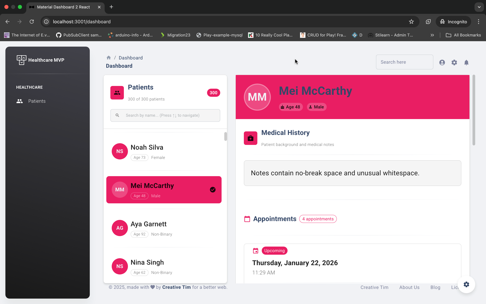

# Healthcare Management System MVP - Frontend

A modern, responsive React frontend application for managing patient information and appointments in a healthcare system.



## 🚀 Features

- **Patient Management**: Browse and search through a list of patients
- **Patient Details**: View comprehensive patient information including demographics and medical history
- **Appointment Tracking**: Display all appointments for selected patients with doctor information
- **Responsive Design**: Fully responsive UI that works on desktop, tablet, and mobile devices
- **Professional UI**: Built with Material Dashboard 2 React for a polished, professional interface

## 🛠️ Tech Stack

- **React 18.2.0** - UI library
- **Material-UI (MUI) 5.12.3** - Component library
- **Material Dashboard 2 React** - Dashboard template
- **React Router DOM 6.11.0** - Client-side routing
- **Vite** - Build tool (via react-scripts)

## 📋 Prerequisites

- Node.js (v14 or higher)
- npm or yarn
- Backend API running on `http://localhost:3000` (see backend repository)

## 🔧 Installation

1. Clone the repository:
```bash
git clone <repository-url>
cd healthcaremvp-frontend
```

2. Install dependencies:
```bash
npm install
```

3. Create a `.env` file in the root directory:
```env
PORT=3001
REACT_APP_API_URL=http://localhost:3000
```

4. Start the development server:
```bash
npm start
```

The application will be available at `http://localhost:3001`

## 📁 Project Structure

```
src/
├── components/          # Reusable UI components
├── context/             # React Context for state management
│   └── HealthcareContext.js
├── examples/            # Material Dashboard components
├── layouts/             # Page layouts
│   └── healthcare/      # Healthcare dashboard layout
│       ├── components/  # Dashboard-specific components
│       │   ├── PatientPane.js
│       │   ├── DetailPane.js
│       │   ├── PatientHeader.js
│       │   ├── MedicalHistoryCard.js
│       │   └── AppointmentList.js
│       └── index.js
├── services/            # API service layer
│   └── api.js
├── assets/              # Static assets (images, themes)
├── App.js               # Main application component
├── index.js             # Application entry point
└── routes.js            # Route configuration
```

## 🎨 Design

The application follows a clean, professional design with:
- **Patient Panel**: Left sidebar with searchable patient list
- **Detail Panel**: Right side showing selected patient details and appointments
- **Material Design**: Consistent use of Material Design principles
- **Accessibility**: ARIA labels, keyboard navigation, and semantic HTML

For detailed design documentation, see [DESIGN.md](./DESIGN.md)

## 🔌 API Integration

The frontend communicates with a REST API backend. The API base URL is configured via the `REACT_APP_API_URL` environment variable.

### API Endpoints Used

- `GET /patients` - Fetch all patients
- `GET /patients/:id` - Fetch patient details
- `GET /appointments?patientId=:id` - Fetch appointments for a patient
- `GET /doctors/:id` - Fetch doctor details

## 🧪 Development

### Available Scripts

- `npm start` - Start development server
- `npm run build` - Build for production
- `npm test` - Run tests
- `npm run lint` - Run ESLint

### Code Style

The project uses ESLint and Prettier for code formatting. Make sure your editor is configured to use these tools.

## 📝 State Management

The application uses React Context API with `useReducer` for global state management. The `HealthcareContext` manages:
- Patient list and search filters
- Selected patient and their details
- Appointments for selected patient
- Doctor information cache
- Loading and error states

## 🎯 Key Features Implementation

### Patient Search
- Real-time search with debouncing
- Filters patients by name
- Shows filtered count

### Patient Selection
- Click to select a patient
- Keyboard navigation support (arrow keys, Home, End)
- Auto-scroll to selected item

### Appointment Display
- Chronological listing of appointments
- Doctor information lookup
- Expandable appointment reasons for long text
- Status indicators

## 📄 License

See [LICENSE.md](./LICENSE.md) for details.

## 👥 Contributing

This is a demonstration MVP project. For production use, consider:
- Adding authentication and authorization
- Implementing error boundaries
- Adding unit and integration tests
- Setting up CI/CD pipelines
- Adding data validation and sanitization

## 🔗 Related

- Backend API: See the backend repository for API documentation
- Design Documentation: [DESIGN.md](./DESIGN.md)
- UX Review: [UX_REVIEW.md](./UX_REVIEW.md)
